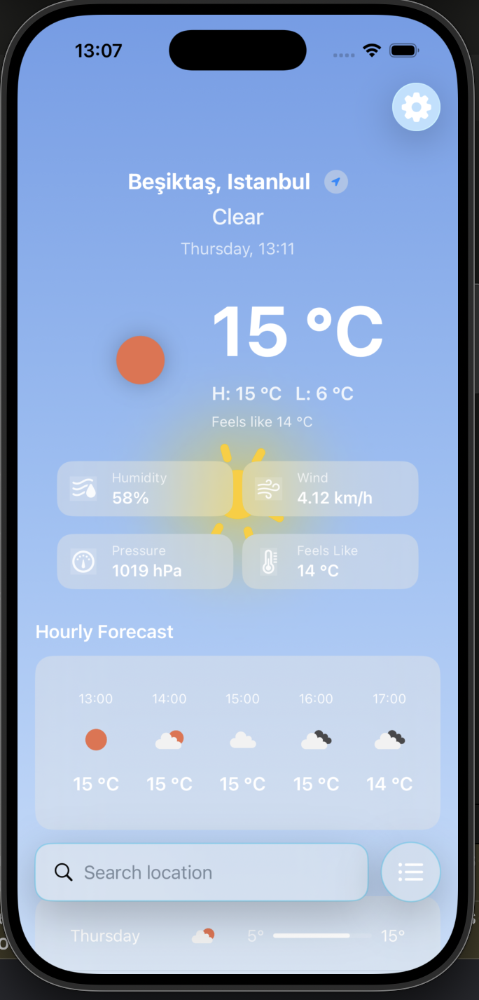
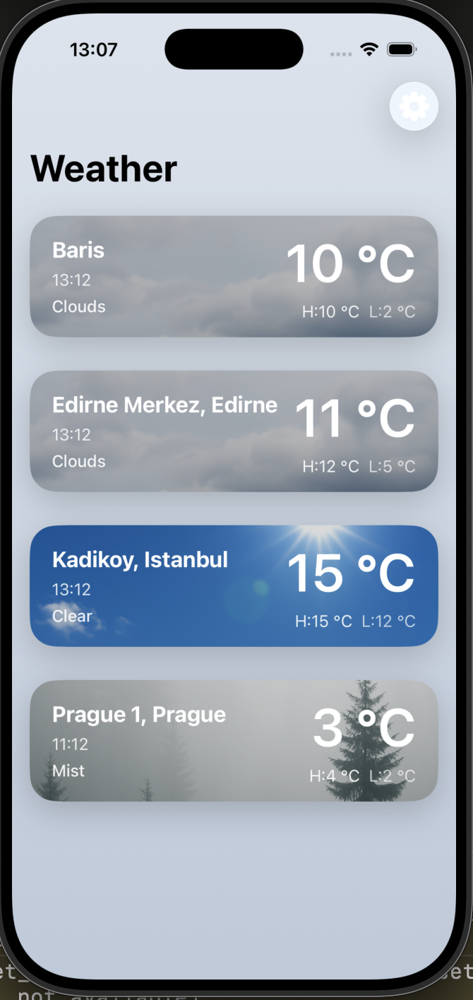
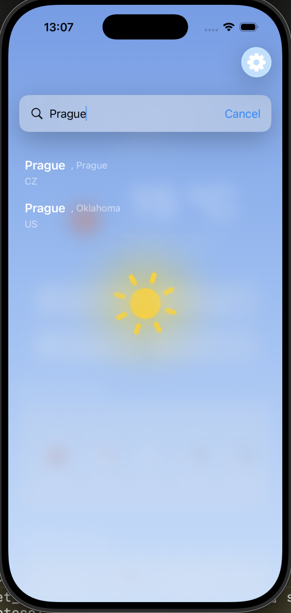
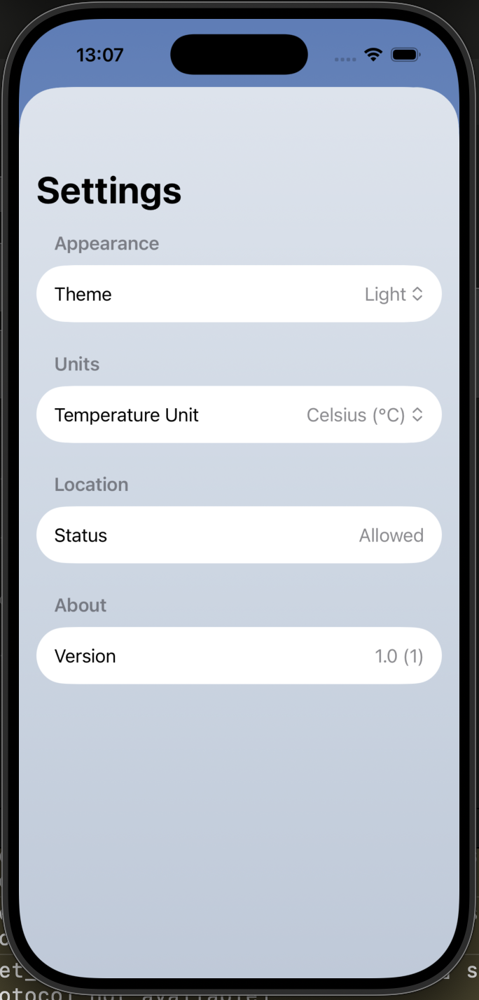

# 🌤️ NimbusWeather

**SwiftUI · Temiz Mimari (Clean Architecture) · Modüler SPM · MVVM · Async/Await · Yüksek Test Kapsamı**

NimbusWeather, **SwiftUI** ve **Temiz Mimari (Clean Architecture)** kullanılarak geliştirilmiş, üretim kalitesinde modern bir iOS hava durumu uygulamasıdır. Proje, **SPM paketlerine** (Domain, Data, Presentation) modüler olarak yapılandırılmıştır. Bu yapı, ölçeklenebilirlik, test edilebilirlik ve sorumlulukların net ayrımını sağlar.

Uygulama, **OpenWeather One Call 3.0 API**'yi tüketir ve reaktif ve görsel olarak dinamik bir deneyimle anlık, saatlik ve günlük hava durumu tahminleri sunar.

---

## 🧱 Proje Mimarisi

Bu proje, katı bağımlılık sınırlarını zorlamak için **Swift Package Manager (SPM)** ile ayrılmış modüller aracılığıyla **Modüler Temiz Mimari (Modular Clean Architecture)** yaklaşımı kullanılarak inşa edilmiştir.

| Modül | Temel Sorumluluk | Ana Bileşenler |
| :--- | :--- | :--- |
| **NimbusWeatherDomain** | **İş Mantığı Çekirdeği** | Kullanım Senaryoları (UseCases), Varlıklar (Entities: FavoriteCity, Weather), Repository Protokolleri |
| **NimbusWeatherData** | **Dış Detaylar** | Repository Uygulamaları (Implementations), Veri Kaynakları (Uzak/Yerel), DTO'lar, Eşleyiciler (Mappers) |
| **NimbusWeather** | **Sunum Katmanı** | Görünümler (Views), Görünüm Modelleri (ViewModels), UI Modelleri, Koordinatör (Akış Kontrolü) |

### Temel Tasarım Kararları

* **MVVM ve Durum Yönetimi:** ViewModel'lar tamamen test edilmiştir ve kullanıcı arayüzü durumunu yönetir.
* **Koordinatör Deseni (Coordinator Pattern):** Gezinme akışı (navigasyon), Görünümlerden ve ViewModel'lardan tamamen izole edilmiştir.
* **Bağımlılıkların Tersine Çevrilmesi Prensibi (DIP):** Tüm üst katmanlar, somut sınıflar yerine Domain katmanında tanımlanmış **protokoller** (soyutlamalar) üzerinden bağımlılıklarını alır.
* **Aktör Tabanlı Eşzamanlılık:** Görüntü yükleme ve önbelleğe alma gibi iş parçacığı açısından güvenli işlemler için kullanılarak veri yarışları (data races) önlenir.

---

## ✨ Özellikler

* **Modülerleştirilmiş SPM Paketleri** kullanılmıştır.
* İzole edilmiş Domain/Data/Presentation katmanlarıyla **Temiz Mimari**.
* Test edilebilir API katmanı ve DTO eşlemesi ile **Async/Await ağ iletişimi**.
* **Aktör tabanlı eşzamanlılık** ile güvenli veri işleme (görüntü yükleme ve favori depolama gibi).
* Kalıcı depolama ile **favori şehirler**.
* Hava koşullarına göre değişen **dinamik arka planlar** 🌦️.
* Verimli API kullanımı için **debounced arama deneyimi**.
* **Tema ve sıcaklık birimi ayarları** (Celsius/Fahrenheit).
* **Tüm katmanlarda yüksek test kapsamı** (Domain, Data, Presentation).

---

## 🧪 Test Stratejisi

NimbusWeather, **test öncelikli bir zihniyetle** geliştirilmiştir ve tüm modüller genelinde **yüksek test kapsamı** içerir.

### ✔ Temel İzolasyon
Tüm testler, harici bağımlılıklar (API'ler, Depolama ve Repository protokolleri) için **Taklit (Mocking) ve Stubbing** teknikleri kullanılarak izole edilmiştir.

### ✔ Test Kapsamları

* **Domain Katmanı:** Kullanım Senaryosu (UseCase) mantığı, Hata dönüşümleri ve Varlık dönüşümleri.
* **Veri Katmanı:** Gerçek JSON armatürleri kullanan Eşleyici (Mapper) testleri, taklit API hizmetiyle Uzak Veri Kaynağı testleri, API Hatası → Domain Hatası eşlemesi için Repository testleri ve Kalıcı favori depolama testleri.
* **Sunum Katmanı:** ViewModel testleri (arama erteleme, hata durumları, veri entegrasyonu mantığı gibi).
* **Eşzamanlılık:** Aktör tabanlı Görüntü Yükleyici testleri (önbellek davranışı, geçersiz veri işleme ve eşzamanlı istek tekilleştirme).

---

## 🎨 UI ve Deneyim

### 🌈 Dinamik Hava Durumu Arka Planları
Kullanıcı arayüzü, mevcut hava koşullarına (örneğin güneşli, bulutlu, yağmurlu, gece koşulları) göre arka planını otomatik olarak değiştirir.

### 📱 Akıcı Kullanıcı Deneyimi Özellikleri
* Ertelemeli arama (Debounced search)
* Animasyonlu geçişler
* Temiz ve modern hava durumu düzenleri
* Sistem Açık / Koyu Mod desteği

---

## 🚀 Kullanılan Teknolojiler

* **Swift 5.9**
* **SwiftUI**
* **async / await & Actors**
* **Combine**
* **Swift Package Manager (SPM)**
* **XCTest (Birim Testleri)**
* **OpenWeather API**
* **CoreLocation / Geocoding**

---

## 📱 Ekran Görüntüleri

### 🎬 Ana Ekran

### 📌 Kayıtlı Konumlar

### 🔍 Arama

### ⚙️ Ayarlar

---

## 🤝 Katkıda Bulunma ve Lisans

Pull request'ler ve sorun bildirimleri kabul edilir.

---

**Geliştirici:** [Barış Görgün](https://github.com/barisgorgun)

[🇬🇧 For English version, click here](README.md)
